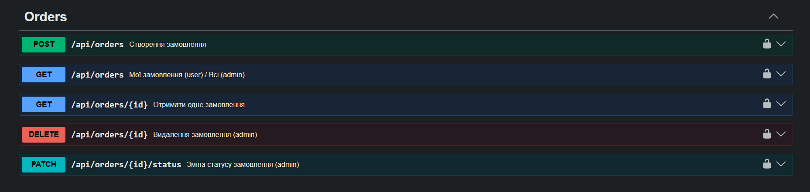

## Student
- Name: Джаваншірі Кіян
- Group: 232/1 оф
 
## MiniShop API — Фінальний проєкт
 
REST API інтернет-магазину на NestJS + PostgreSQL + Redis.
 
### Технології
- NestJS + TypeScript
- PostgreSQL + TypeORM (міграції, QueryBuilder)
- Redis (кешування з інвалідацією)
- JWT автентифікація + RBAC авторизація
- class-validator + class-transformer
- Swagger / OpenAPI
 
### Запуск
```bash
cp .env.example .env
docker compose up --build
docker compose run --rm app npm run seed
```
 
### Swagger UI
http://localhost:3000/api/docs

 
### API Endpoints
 
#### Auth
| Method | URL | Auth | Опис |
|--------|-----|------|------|
| POST | /auth/register | - | Реєстрація |
| POST | /auth/login | - | Логін → JWT |
 
#### Categories
| Method | URL | Auth | Опис |
|--------|-----|------|------|
| GET | /api/categories | - | Список |
| GET | /api/categories/:id | - | Одна |
| POST | /api/categories | admin | Створити |
| PATCH | /api/categories/:id | admin | Оновити |
| DELETE | /api/categories/:id | admin | Видалити |
 
#### Products
| Method | URL | Auth | Опис |
|--------|-----|------|------|
| GET | /api/products | - | Список + pagination + filter |
| GET | /api/products/:id | - | Один |
| POST | /api/products | admin | Створити |
| PATCH | /api/products/:id | admin | Оновити |
| DELETE | /api/products/:id | admin | Видалити |
 
#### Orders
| Method | URL | Auth | Опис |
|--------|-----|------|------|
| POST | /api/orders | user | Створити замовлення |
| GET | /api/orders | user | Мої / Всі (admin) |
| GET | /api/orders/:id | user | Одне (ownership) |
| PATCH | /api/orders/:id/status | admin | Змінити статус |
| DELETE | /api/orders/:id | admin | Видалити |
 
### Тест створення замовлення
```text
<вивід curl POST /api/orders>
{"data":{"id":1,"status":"pending","totalPrice":"120.00","items":[{"id":1,"quantity":2,"price":"50.00","product":{"id":1,"name":"iPhone 15"}},{"id":2,"quantity":1,"price":"20.00","product":{"id":5,"name":"Headphones"}}],"createdAt":"2026-05-24T10:03:00.000Z"},"statusCode":201,"timestamp":"2026-05-24T10:03:01.000Z"}
```
 
### Тест ownership (403)
```text
<вивід curl GET /api/orders/:id з чужим токеном>
{"error":{"code":403,"message":"You can only view your own orders","traceId":"a1b2c3d4-e5f6-7890-abcd-ef1234567890"},"timestamp":"2026-05-24T10:06:00.000Z"}
```
 
### Тест зміни статусу
```text
<вивід curl PATCH /api/orders/:id/status>
{"data":{"id":1,"status":"confirmed","totalPrice":"120.00"},"statusCode":200,"timestamp":"2026-05-24T10:08:00.000Z"}
```
 
### Тест insufficient stock
```text
<вивід curl POST /api/orders з quantity > stock>
{"error":{"code":400,"message":"Insufficient stock for \"iPhone 15\": available 8, requested 99999","traceId":"99887766-5544-3322-1100-aabbccddeeff"},"timestamp":"2026-05-24T10:10:00.000Z"}
```
