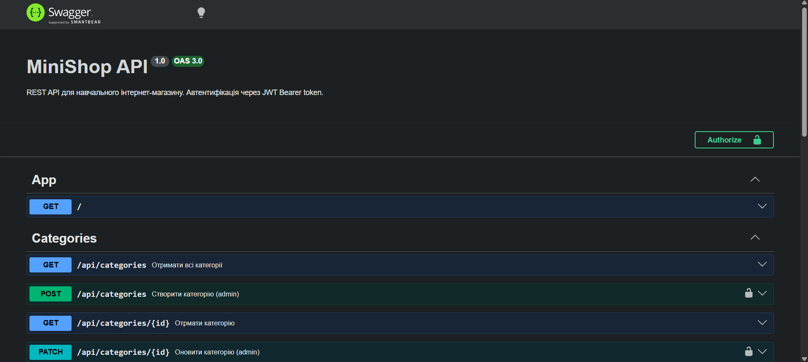

## Student
- Name: Джаваншірі Кіян
- Group: 232/1 оф
 
## Практичне заняття №6 — Interceptors + Exception Filters + Swagger
 
### Структура репозиторію
```
.
├── src/
│   ├── auth/ ...
│   ├── users/ ...
│   ├── categories/ ...
│   ├── products/ ...
│   ├── common/
│   │   ├── enums/
│   │   │   └── role.enum.ts
│   │   ├── guards/
│   │   │   ├── jwt-auth.guard.ts
│   │   │   └── roles.guard.ts
│   │   ├── decorators/
│   │   │   ├── current-user.decorator.ts
│   │   │   └── roles.decorator.ts
│   │   ├── interceptors/
│   │   │   ├── logging.interceptor.ts
│   │   │   └── transform.interceptor.ts
│   │   ├── filters/
│   │   │   └── http-exception.filter.ts
│   │   └── pipes/
│   │   	└── trim.pipe.ts
│   ├── migrations/
│   ├── main.ts
│   └── app.module.ts
├── swagger-screenshot.png
├── Dockerfile
├── docker-compose.yml
└── README.md
```
 
### Запуск проекту
```bash
cp .env.example .env
docker compose up --build
```
 
### Swagger UI
http://localhost:3000/api/docs
 


### Формат успішної відповіді
```json
{
  "data": { ... },
  "statusCode": 200,
  "timestamp": "2025-01-15T10:30:00.000Z"
}
```
 
### Формат помилки
```json
{
  "error": {
	"code": 400,
	"message": "Validation failed",
	"details": ["name must be longer..."],
	"traceId": "a1b2c3..."
  },
  "timestamp": "2025-01-15T10:31:00.000Z"
}
```
 
### Приклад логів (LoggingInterceptor)
```text
<вивід docker compose logs з рядками [HTTP] GET /api/products ...>
LOG [HTTP] GET /api/products — 200 — 11ms
```
 
### Тест помилки з traceId
```text
<вивід curl GET /api/products/999>
{"error":{"code":404,"message":"Product #999 not found","traceId":"d294bc70-51e3-4424-aef4-e91b3daf33a8"},"timestamp":"2026-05-04T13:22:03.621Z"}
```
